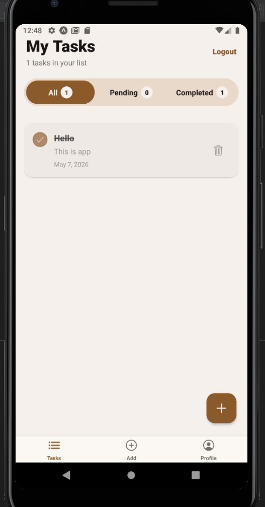
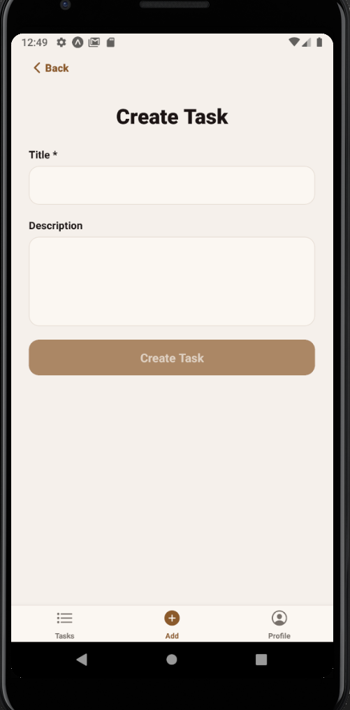
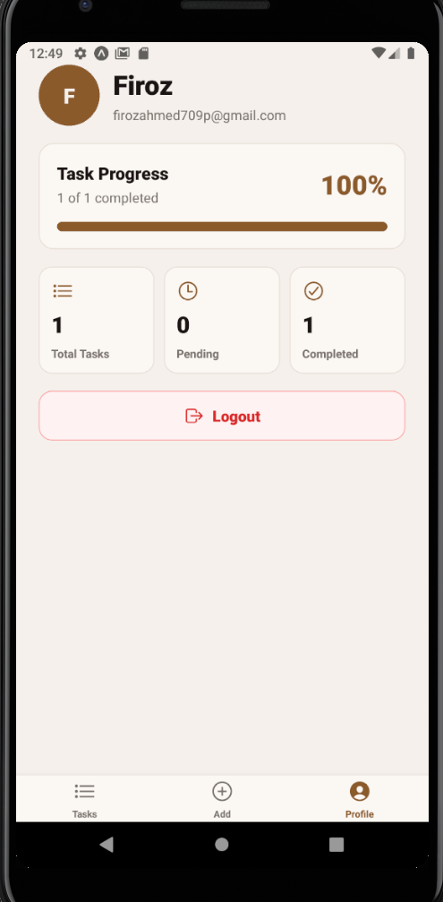
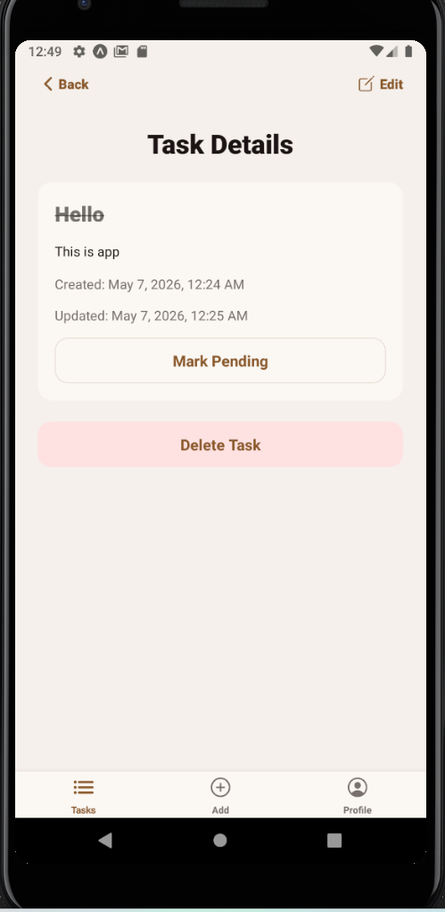
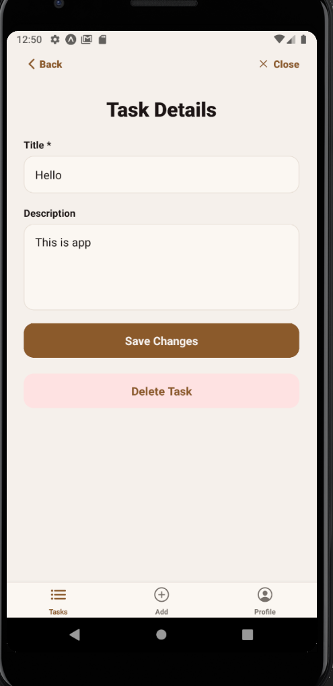

# Task Tracker

A full-stack task tracker built with a React Native Expo mobile app and a Node.js Express MongoDB backend.

The app supports account signup, login, persisted sessions, task creation, task editing, task completion toggles, pending/completed filters, profile statistics, and authenticated backend APIs.







## Features

- User signup and login with JWT authentication
- Password hashing with bcrypt
- Persisted mobile login session with Expo SecureStore
- Create, view, edit, complete, filter, and delete tasks
- Pending and completed task filters with counts
- Profile screen with task progress statistics
- Protected backend task routes
- MongoDB persistence with Mongoose
- TypeScript on frontend and backend
- Monorepo-style folder structure with separate `backend` and `mobile` apps

## Tech Stack

Frontend:
- React Native
- Expo
- TypeScript
- React Navigation
- TanStack Query
- Axios
- Expo SecureStore
- Expo Vector Icons

Backend:
- Node.js
- Express.js
- TypeScript
- MongoDB
- Mongoose
- JSON Web Tokens
- bcryptjs
- express-validator

## Folder Structure

```text
task-tracker/
|-- backend/
|   |-- src/
|   |   |-- config/
|   |   |-- controllers/
|   |   |-- middleware/
|   |   |-- models/
|   |   |-- routes/
|   |   |-- types/
|   |   |-- validators/
|   |   `-- index.ts
|   |-- .env.example
|   |-- package.json
|   `-- tsconfig.json
|-- mobile/
|   |-- src/
|   |   |-- api/
|   |   |-- components/
|   |   |-- hooks/
|   |   |-- navigation/
|   |   |-- screens/
|   |   |-- store/
|   |   |-- types/
|   |   `-- utils/
|   |-- .env.example
|   |-- app.config.js
|   |-- app.json
|   |-- package.json
|   `-- tsconfig.json
|-- docs/
|   |-- demo-video-script.md
|   `-- submission-checklist.md
|-- package.json
`-- README.md
```

## Prerequisites

- Node.js 18 or newer
- npm
- MongoDB Atlas account or local MongoDB
- Android Studio emulator, iOS simulator, or Expo Go
- Git

## Backend Setup

1. Go to the backend folder.

```bash
cd backend
```

2. Install dependencies.

```bash
npm install
```

3. Create environment file.

```bash
cp .env.example .env
```

On Windows PowerShell:

```powershell
Copy-Item .env.example .env
```

4. Add backend environment values.

```env
PORT=5000
MONGO_URI=mongodb://127.0.0.1:27017/task-tracker
JWT_SECRET=replace_with_a_long_random_secret
JWT_EXPIRES_IN=7d
CORS_ORIGIN=*
```

5. Start the backend.

```bash
npm run dev
```

The backend runs on:

```text
http://localhost:5000
```

Health check:

```text
GET http://localhost:5000/health
```

## Mobile Setup

1. Go to the mobile folder.

```bash
cd mobile
```

2. Install dependencies.

```bash
npm install
```

3. Create environment file.

```bash
cp .env.example .env
```

On Windows PowerShell:

```powershell
Copy-Item .env.example .env
```

4. Set the backend API URL.

For Android emulator:

```env
EXPO_PUBLIC_API_URL=http://10.0.2.2:5000
```

For physical phone on the same Wi-Fi, use your computer LAN IP:

```env
EXPO_PUBLIC_API_URL=http://192.168.0.119:5000
```

5. Start Expo.

```bash
npx expo start -c
```

Open the app with:

- `a` for Android emulator
- Expo Go QR code for a physical phone
- `w` for web preview where supported

## Run From Root

Install both apps:

```bash
npm run install:all
```

Run backend:

```bash
npm run dev:backend
```

Run mobile:

```bash
npm run dev:mobile
```

Run backend, Android emulator, and Expo together on Windows:

```powershell
npm run dev:android
```

Run TypeScript checks:

```bash
npm run typecheck
```

## API Endpoints

Authentication:

| Method | Endpoint | Description |
| --- | --- | --- |
| GET | `/health` | Backend health check |
| POST | `/auth/signup` | Create a new user account |
| POST | `/auth/login` | Login and return JWT |

Tasks:

| Method | Endpoint | Auth | Description |
| --- | --- | --- | --- |
| GET | `/tasks` | Yes | Get all tasks for logged-in user |
| GET | `/tasks?status=pending` | Yes | Get pending tasks |
| GET | `/tasks?status=completed` | Yes | Get completed tasks |
| POST | `/tasks` | Yes | Create task |
| PATCH | `/tasks/:id` | Yes | Edit title, description, or completion status |
| DELETE | `/tasks/:id` | Yes | Delete task |

## Main User Flow

1. Sign up with name, email, and password.
2. The backend hashes the password and returns a JWT.
3. The mobile app stores the JWT securely with Expo SecureStore.
4. Create a task with title and description.
5. Tap a task to open details.
6. Press Edit to update the task.
7. Mark tasks completed or pending.
8. Use All, Pending, and Completed filters.
9. Open Profile to view task statistics.
10. Close and reopen the app to confirm the login session persists.
11. Logout to clear the local session.

## GitHub Repository

This project is prepared as one repository containing both frontend and backend.

To upload:

```bash
git init
git add .
git commit -m "Complete full-stack task tracker"
git branch -M main
git remote add origin https://github.com/YOUR_USERNAME/task-tracker.git
git push -u origin main
```

Do not commit real `.env` files. Commit only `.env.example`.

## Demo Video

Record a short demo showing:

1. Backend running
2. Expo mobile app running
3. Signup
4. Login persistence
5. Create task
6. Edit task
7. Mark completed and pending
8. Filter All, Pending, Completed
9. Profile stats
10. Logout

A full 20-minute speaking script is available in:

```text
docs/demo-video-script.md
```

After recording, add your video link here:

```text
Demo video: add-your-link-here
```

## Verification

Mobile typecheck:

```bash
cd mobile
npm run typecheck
```

Backend typecheck:

```bash
cd backend
npm run typecheck
```
